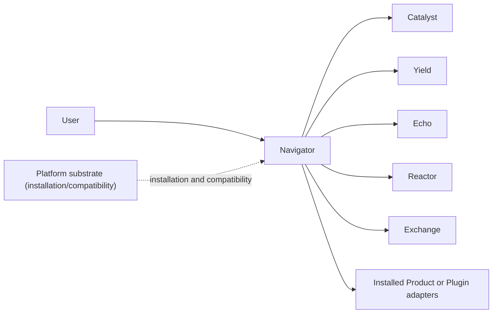

# Navigator Product API and Desktop Contract

Navigator is an active Product that owns the desktop workspace, client-side
session state, persistence service, and user-triggered handoffs. It is a
horizontal client rather than a payload-processing hub.

## Authority and request paths

Navigator calls each Product or installed Plugin directly for its domain
operation. Platform does not relay dataset, training, serving, evaluation, or
conversation payloads. Adding a Product or Plugin adapter must therefore change
the owning repository or Navigator adapter, while the published Platform
contract remains unchanged.

## Navigator-owned surfaces

- `contracts/product/v1/persistence.openapi.yaml`: session persistence and the
  explicit `Send to Echo` handoff.
- `src/cyrene_navigator/persistence`: session authority and the local Artifact
  adapter used by that handoff.
- `native/crates/cyrene-native-host`: Navigator-owned Codex rollout import over
  the versioned NDJSON protocol.
- `harness`: replaceable DeepSeek Harness adapters and profile integration.
- `apps/desktop`: the standalone browser WebUI.
- `apps/windows`: the native Windows client surface.

The Artifact adapter publishes immutable content-addressed bytes and returns the
standard transparent fields: `uri`, `digest`, `size_bytes`, and producer-owned
`kind`. It does not add a second global registry or duplicate Product lifecycle
state.

## Compatibility boundary

Navigator contains no Product capability implementation, old typed SPI
registration, Platform source dependency, or Platform executable bootstrap.
Optional Platform management is outside the request path and communicates only
through published compatibility contracts.

`apps/windows` is an `API_CONNECTED_PROTOTYPE`: reads (session list, committed
events, run trace) come from the Navigator persistence API through `Core/Ports`,
and control actions that need the Harness control route fail closed with
`NAVIGATOR_CONTROL_NOT_CONNECTED`. Preview fixtures in `Core/Mock` are Debug-only
and excluded from Release builds. The WinUI surface remains unpackaged until its
signing policy is complete.

The browser WebUI is intentionally smaller than the native surface at this
stage. `apps/desktop/ui` performs an HTTP API availability probe and links to
the API documentation; it does not yet render conversations or send/control
Harness turns. This repository therefore has no packaged or signed desktop
release, and the source-preview status must remain visible in release notes.

当前阶段浏览器 WebUI 有意比原生界面更小。`apps/desktop/ui` 只做 HTTP API 可用性探测并链接
API 文档，尚未渲染会话或发送/控制 Harness turn。因此本仓库没有已打包或已签名的桌面发布物，
release notes 必须保留源代码预览状态。
