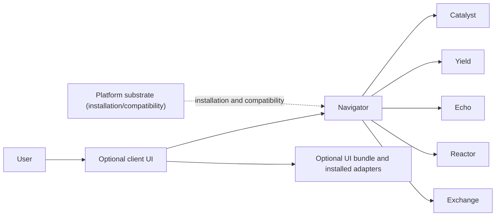

# Navigator Product API Contract

Navigator is an active Product that owns durable session state, its persistence
service, native host, and user-triggered handoffs. Optional client interfaces
consume this contract without becoming a second Product authority.

## Authority and request paths

Navigator calls each Product or installed Plugin directly for its domain
operation. Platform does not relay dataset, training, serving, evaluation, or
conversation payloads. Adding a Product or Plugin adapter must therefore change
the owning repository or Navigator adapter, while the published Platform
contract remains unchanged.

## Navigator-owned surfaces

- `contracts/product/v1/persistence.openapi.yaml`: session persistence and the
  explicit `Send to Echo` handoff.
- `src/cyrene_navigator/persistence`: session authority and the local Artifact
  adapter used by that handoff.
- `native/crates/cyrene-native-host`: Navigator-owned Codex rollout import over
  the versioned NDJSON protocol.
- `harness`: replaceable DeepSeek Harness adapters and profile integration.

The Artifact adapter publishes immutable content-addressed bytes and returns the
standard transparent fields: `uri`, `digest`, `size_bytes`, and producer-owned
`kind`. It does not add a second global registry or duplicate Product lifecycle
state. The explicit Echo handoff accepts only Echo's HTTP 201 creation response
and requires the returned `resourceRef.uri` to identify exactly the same
evaluation input as `resourceRef.id`; other 2xx responses and mismatched target
identities fail closed as `NAVIGATOR_ECHO_HANDOFF_FAILED`.

## Compatibility boundary

Navigator contains no Product capability implementation, old typed SPI
registration, Platform source dependency, or Platform executable bootstrap.
Optional Platform management is outside the request path and communicates only
through published compatibility contracts.

The browser and WinUI clients are owned by
`Cyrene-Plugins-Official/plugins/ui/navigator`. Their Product-client adapters
consume this published API; they must not persist authoritative session state
or copy Navigator lifecycle logic. Packaging and signing status are reported by
that bundle, not by this contract repository.

浏览器与 WinUI 客户端归属 `Cyrene-Plugins-Official/plugins/ui/navigator`。其中的 Product
客户端适配器消费本公开 API，不得持久化权威会话状态或复制 Navigator 生命周期逻辑。打包与
签名状态由该 UI 包报告，不由本契约仓库声明。
---
<!-- Chinese Translation / 中文翻译 -->

# Navigator Product API 契约

Navigator 是一个活跃的 Product，拥有持久化会话状态、持久化服务、原生宿主和由用户触发的交接。可选客户端接口可以消费此契约，但不会成为第二个 Product 权威。

## 权威与请求路径

用户通过可选客户端 UI 调用 Navigator。Navigator 按业务域直接调用 Catalyst、Yield、Echo、Reactor 或 Exchange。可选 UI bundle 和已安装适配器不改变 Product 权威。Platform 只提供安装/兼容性底座，不会中转数据集、训练、服务、评估或对话负载。因此新增 Product 或 Plugin 适配器应修改其 owner 仓库或 Navigator 适配器，已发布的 Platform 契约保持不变。

## Navigator 所有的接口

- `contracts/product/v1/persistence.openapi.yaml`：会话持久化和显式的 `Send to Echo` 交接。
- `src/cyrene_navigator/persistence`：会话权威以及交接使用的本地 Artifact 适配器。
- `native/crates/cyrene-native-host`：Navigator 所有的 Codex rollout 导入，使用版本化 NDJSON 协议。
- `harness`：可替换的 DeepSeek Harness 适配器和 Profile 集成。

Artifact 适配器发布不可变的内容寻址字节，并返回标准透明字段：`uri`、`digest`、`size_bytes` 和由生产方拥有的 `kind`。它不会添加第二个全局注册表或重复 Product 生命周期状态。显式 Echo 交接只接受 Echo 的 HTTP 201 创建响应，并要求返回的 `resourceRef.uri` 与 `resourceRef.id` 指向完全相同的评估输入；其他 2xx 响应或目标身份不匹配均以 `NAVIGATOR_ECHO_HANDOFF_FAILED` fail-closed。

## 兼容性边界

Navigator 不包含 Product capability 实现、旧 typed SPI 注册、Platform 源码依赖或 Platform 可执行文件引导。可选 Platform 管理功能不在请求路径中，只通过已发布的兼容契约通信。

浏览器与 WinUI 客户端归 `Cyrene-Plugins-Official/plugins/ui/navigator` 所有。它们的 Product 客户端适配器消费本 API；不得持久化权威会话状态或复制 Navigator 生命周期逻辑。打包与签名状态由该 UI 包报告，而不是由本契约仓库声明。
