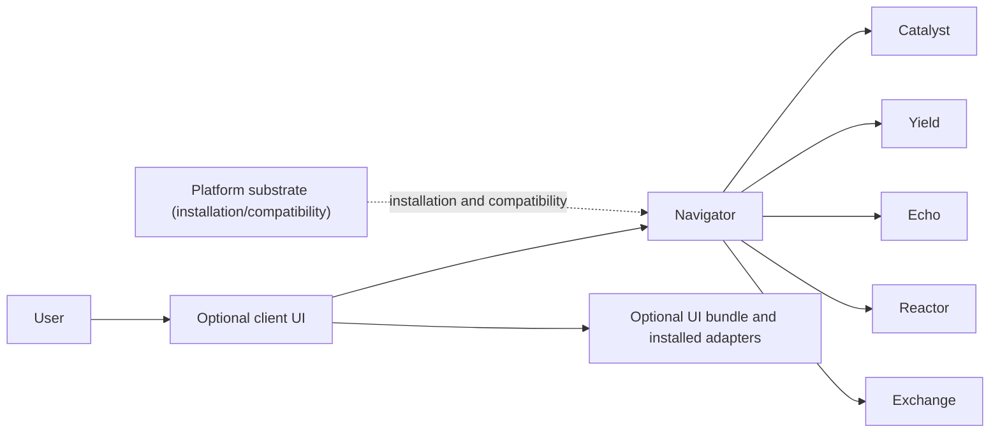

# Navigator Product API Contract

Navigator is an active Product that owns durable session state, its persistence
service, native host, and user-triggered handoffs. Optional client interfaces
consume this contract without becoming a second Product authority.

## Authority and request paths

Navigator calls each Product or installed Plugin directly for its domain
operation. Platform does not relay dataset, training, serving, evaluation, or
conversation payloads. Adding a Product or Plugin adapter must therefore change
the owning repository or Navigator adapter, while the published Platform
contract remains unchanged.

## Navigator-owned surfaces

- `contracts/product/v1/persistence.openapi.yaml`: session persistence and the
  explicit `Send to Echo` handoff.
- `src/cyrene_navigator/persistence`: session authority and the local Artifact
  adapter used by that handoff.
- `native/crates/cyrene-native-host`: Navigator-owned Codex rollout import over
  the versioned NDJSON protocol.
- `harness`: replaceable DeepSeek Harness adapters and profile integration.

The Artifact adapter publishes immutable content-addressed bytes and returns the
standard transparent fields: `uri`, `digest`, `size_bytes`, and producer-owned
`kind`. It does not add a second global registry or duplicate Product lifecycle
state.

## Compatibility boundary

Navigator contains no Product capability implementation, old typed SPI
registration, Platform source dependency, or Platform executable bootstrap.
Optional Platform management is outside the request path and communicates only
through published compatibility contracts.

The browser and WinUI clients are owned by
`Cyrene-Plugins-Official/plugins/ui/navigator`. Their Product-client adapters
consume this published API; they must not persist authoritative session state
or copy Navigator lifecycle logic. Packaging and signing status are reported by
that bundle, not by this contract repository.

浏览器与 WinUI 客户端归属 `Cyrene-Plugins-Official/plugins/ui/navigator`。其中的 Product
客户端适配器消费本公开 API，不得持久化权威会话状态或复制 Navigator 生命周期逻辑。打包与
签名状态由该 UI 包报告，不由本契约仓库声明。
