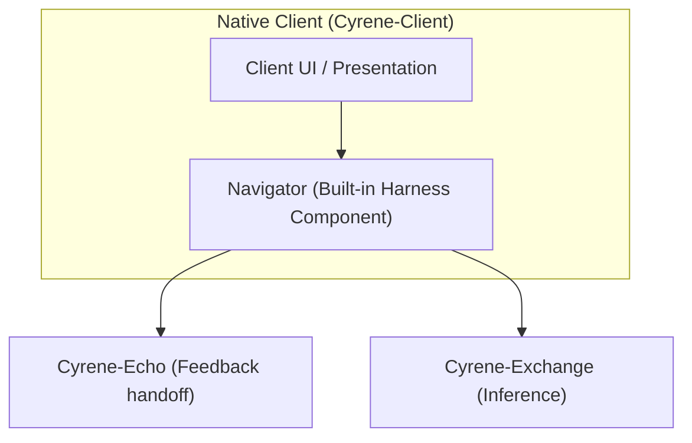

# Navigator Session & Harness API Contract

Navigator is the **built-in Harness component** of the Native Client (`Cyrene-Client`), developed as a secondary development of **DeepSeek harness** (`@deepseek-ai/deepseek-harness`). It owns durable session state, its local persistence service, native host, and user-triggered handoffs.

**Key Invariant**: Navigator carries **NO UI** and no unrelated service features. All presentation is owned by the Native Client (`Cyrene-Client`).

## Authority and request paths

```mermaid
flowchart TD
    subgraph Client["Native Client (Cyrene-Client)"]
        UI["Client UI / Presentation"] --> Navigator["Navigator (Built-in Harness Component)"]
    end
    Navigator --> Echo["Cyrene-Echo (Feedback handoff)"]
    Navigator --> Exchange["Cyrene-Exchange (Inference)"]
```

The browser-facing `POST /api/v1/workspace-snapshots` requires a configured
bearer principal whose server-side organization and Workspace scope matches
`workspaceId`. Navigator does not accept a caller-selected organization and does
not forward the browser bearer to a Product. Each downstream Product bearer is
selected from server configuration by `(Product, organization_id, workspace_id)`;
missing credentials fail closed without an unauthenticated Product request.
Only the private, fixed Product READ paths in
[`product-read-port.md`](../contracts/product/v1/product-read-port.md) are
accepted. The response `sourceOperation` is a fixed OpenAPI operation label for
non-navigable provenance; it carries no URL, path, host, or resource identifier.
Each available view returns only a closed `resourceSummary` digest and byte
length. Raw owner JSON stays inside Navigator.
The internal persistence runner mounts this endpoint
on the same loopback-default listener. It loads URL and credential values from
named environment variables; missing service maps or an exact requested scope
return 503 without an upstream Product call. The runner does not configure
public ingress.

The internal session READ alias is `GET
/internal/workspace/v1/workspaces/{workspace_id}/sessions/{session_id}` with
operation ID `getWorkspaceSession`. Its service Bearer must resolve to the exact
organization and Workspace; the session ID is the sole resource path parameter.
The response is a closed summary and omits arbitrary Harness header metadata.

## Navigator-owned surfaces

- `contracts/product/v1/persistence.openapi.yaml`: session persistence and the
  explicit `Send to Echo` handoff.
- `src/cyrene_navigator/persistence`: session authority and the local Artifact
  adapter used by that handoff.
- `native/crates/cyrene-native-host`: Navigator-owned Codex rollout import over
  the versioned NDJSON protocol.
- `harness`: replaceable DeepSeek Harness adapters and profile integration.

The Artifact adapter publishes immutable content-addressed bytes and returns the
standard transparent fields: `uri`, `digest`, `size_bytes`, and producer-owned
`kind`. It does not add a second global registry or duplicate Product lifecycle
state. The explicit Echo handoff accepts only Echo's HTTP 201 creation response
and requires the returned `resourceRef.uri` to identify exactly the same
evaluation input as `resourceRef.id`; other 2xx responses and mismatched target
identities fail closed as `NAVIGATOR_ECHO_HANDOFF_FAILED`.

## Compatibility boundary

Navigator contains no Product capability implementation, old typed SPI
registration, Platform source dependency, or Platform executable bootstrap.
Optional Platform management is outside the request path and communicates only
through published compatibility contracts.

Navigator carries NO user interface (UI); all presentation, consoles, and interactive user experiences are exclusively owned and rendered by the Native Client (`Cyrene-Client`).

---
<!-- Chinese Translation / 中文翻译 -->

# Navigator 会话与 Harness API 契约

Navigator 是 Native Client（`Cyrene-Client`）的**内置 Harness 组件**，基于 **DeepSeek harness**（`@deepseek-ai/deepseek-harness`）进行二次开发。它拥有持久化会话状态、本地持久化服务、原生宿主和用户触发的交接。

**核心不变量**：Navigator 本身不带 UI，也不承担其他无关服务功能。所有的图形界面与交互面板均由 Native Client（`Cyrene-Client`）拥有与渲染。

## 权威与请求路径

Navigator 作为 Native Client 的内置 Harness 模块运行。Native Client 工作台界面直接调用 Navigator 驱动 Agent 执行循环与会话持久化；Navigator 按需对接 Exchange 进行模型推理，以及对接 Echo 提交评估交接。Platform 只提供底层安装/兼容性支持，不中转对话负载。

面向浏览器的 `POST /api/v1/workspace-snapshots` 要求配置好的 bearer principal，其服务端
organization 与 Workspace scope 必须和 `workspaceId` 匹配。Navigator 不接受调用方指定
organization，也不向 Product 转发浏览器 bearer。每个下游 Product bearer 都按
`(Product, organization_id, workspace_id)` 从服务端配置选择；缺少凭据时 fail closed，不会发出
未认证的 Product 请求。只接受
[`product-read-port.md`](../contracts/product/v1/product-read-port.md) 中固定的私有 Product READ 路径。
响应 `sourceOperation` 是不可导航的固定 OpenAPI operation 来源标签，不携带 URL、path、host 或资源 ID。
每个可用 view 只返回封闭的 `resourceSummary` digest 和字节长度；原始 owner JSON 保留在 Navigator 内部。
内部 persistence runner 会将此 endpoint 挂到同一个默认绑定 loopback 的 listener。
它按命名的环境变量读取 URL 和 credential；缺少 service map 或请求的精确 scope 时返回 503，且不会请求
上游 Product。runner 不配置公网 ingress。

内部会话 READ alias 为 `GET /internal/workspace/v1/workspaces/{workspace_id}/sessions/{session_id}`，
operation ID 是 `getWorkspaceSession`。service Bearer 必须映射到完全匹配的 organization 与 Workspace；
session ID 是唯一资源路径参数。响应为封闭摘要，不包含任意 Harness header metadata。

## Navigator 所有的接口

- `contracts/product/v1/persistence.openapi.yaml`：会话持久化和显式的 `Send to Echo` 交接。
- `src/cyrene_navigator/persistence`：会话权威以及交接使用的本地 Artifact 适配器。
- `native/crates/cyrene-native-host`：Navigator 所有的 Codex rollout 导入，使用版本化 NDJSON 协议。
- `harness`：可替换的 DeepSeek Harness 适配器和 Profile 集成。

Artifact 适配器发布不可变的内容寻址字节，并返回标准透明字段：`uri`、`digest`、`size_bytes` 和由生产方拥有的 `kind`。它不会添加第二个全局注册表或重复 Product 生命周期状态。显式 Echo 交接只接受 Echo 的 HTTP 201 创建响应，并要求返回的 `resourceRef.uri` 与 `resourceRef.id` 指向完全相同的评估输入；其他 2xx 响应或目标身份不匹配均以 `NAVIGATOR_ECHO_HANDOFF_FAILED` fail-closed。

## 兼容性边界

Navigator 本身不包含任何 UI；所有图形界面、工作台操作台及可视化交互均由 Native Client（`Cyrene-Client`）独占拥有与呈现。
