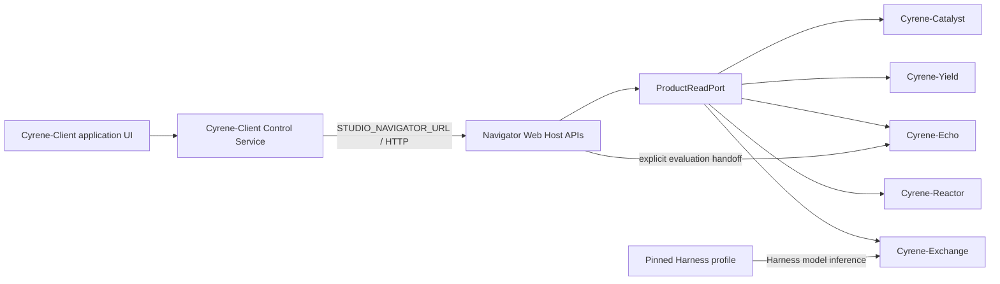

# Navigator Product, Session & Harness API Contract

Navigator composes a pinned revision of the upstream [DeepSeek Harness repository](../harness/upstream.lock.json) with Cyrene adapters. It provides local session persistence APIs, a bounded Product workspace-read API, explicit handoffs, and a Rust native host for Codex rollout import over versioned NDJSON. The separate `Cyrene-Client` control service reaches the Navigator Web Host through its configured service URL. The `harness/src/client/` UI adapters are part of this repository's Harness profile and are distinct from the Client application UI.

`Cyrene-Client` owns the application shell and primary user-facing presentation. Its control service reaches the separately running Navigator Web Host through `STUDIO_NAVIGATOR_URL`. Navigator also contains UI adapter code for its pinned Harness profile; it does not provide a standalone client application.

## Authority and request paths

```mermaid
flowchart LR
    Client["Cyrene-Client application UI"] --> Control["Cyrene-Client Control Service"]
    Control -->|STUDIO_NAVIGATOR_URL / HTTP| WebHost["Navigator Web Host APIs"]
    WebHost --> Read["ProductReadPort"]
    Read --> Catalyst["Cyrene-Catalyst"]
    Read --> Yield["Cyrene-Yield"]
    Read --> Echo["Cyrene-Echo"]
    Read --> Reactor["Cyrene-Reactor"]
    Read --> Exchange["Cyrene-Exchange"]
    HarnessRuntime["Pinned Harness profile"]
    HarnessRuntime -->|Harness model inference| Exchange
    WebHost -->|explicit evaluation handoff| Echo
```

The Product snapshot fan-out is a bounded read path. Harness model inference
uses Exchange, while the explicit evaluation handoff to Echo is a separate
write path.

The browser-facing `POST /api/v1/workspace-snapshots` requires a configured
bearer principal whose server-side organization and Workspace scope matches
`workspaceId`. Navigator does not accept a caller-selected organization and does
not forward the browser bearer to a Product. Each downstream Product bearer is
selected from server configuration by `(Product, organization_id, workspace_id)`;
missing credentials fail closed without an unauthenticated Product request.
Only the private, fixed Product READ paths in
[`product-read-port.md`](../contracts/product/v1/product-read-port.md) are
accepted. The response `sourceOperation` is a fixed OpenAPI operation label for
non-navigable provenance; it carries no URL, path, host, or resource identifier.
Each available view returns only a closed `resourceSummary` digest and byte
length. Raw owner JSON stays inside Navigator.
The internal persistence runner mounts this endpoint
on the same loopback-default listener. It loads URL and credential values from
named environment variables; missing service maps or an exact requested scope
return 503 without an upstream Product call. The runner does not configure
public ingress.

The internal session READ alias is `GET
/internal/workspace/v1/workspaces/{workspace_id}/sessions/{session_id}` with
operation ID `getWorkspaceSession`. Its service Bearer must resolve to the exact
organization and Workspace; the session ID is the sole resource path parameter.
The response is a closed summary and omits arbitrary Harness header metadata.

## Navigator-owned surfaces

- `contracts/product/v1/openapi.yaml`: the bounded Workspace Product-read
  snapshot API.
- `src/cyrene_navigator/reader.py` and `service.py`: Navigator's Product read
  port and aggregation service.
- `contracts/product/v1/persistence.openapi.yaml`: session persistence and the
  explicit `Send to Echo` handoff.
- `src/cyrene_navigator/persistence`: session authority and the local Artifact
  adapter used by that handoff.
- `native/crates/cyrene-native-host`: Navigator-owned Codex rollout import over
  the versioned NDJSON protocol.
- `harness`: replaceable DeepSeek Harness adapters and profile integration.

The Artifact adapter publishes immutable content-addressed bytes and returns the
standard transparent fields: `uri`, `digest`, `size_bytes`, and producer-owned
`kind`. It does not add a second global registry or duplicate Product lifecycle
state. The explicit Echo handoff accepts only Echo's HTTP 201 creation response
and requires the returned `resourceRef.uri` to identify exactly the same
evaluation input as `resourceRef.id`; other 2xx responses and mismatched target
identities fail closed as `NAVIGATOR_ECHO_HANDOFF_FAILED`.

## Compatibility boundary

Navigator contains no Product capability implementation, old typed SPI
registration, Platform source dependency, or Platform executable bootstrap.
Optional Platform management is outside the request path and communicates only
through published compatibility contracts. The client application owns primary
presentation; the `harness/src/client/` directory contains adapter code, not a
standalone application shell.

---
<!-- Chinese Translation / 中文翻译 -->

# Navigator Product、会话与 Harness API 契约

Navigator 将固定版本的上游 [DeepSeek Harness 仓库](../harness/upstream.lock.json) 与 Cyrene 适配器组合，并提供本地会话持久化 API、受限的 Product Workspace 读取 API、显式交接，以及通过版本化 NDJSON 导入 Codex rollout 的 Rust 原生宿主。独立的 `Cyrene-Client` control service 通过配置的服务 URL 访问 Navigator Web Host。本仓库也包含 pinned Harness profile 的 UI 适配器代码。

`Cyrene-Client` 拥有应用 shell 和主要面向用户的展示层；其 control service 通过 `STUDIO_NAVIGATOR_URL` 访问独立运行的 Navigator Web Host。Navigator 也包含 pinned Harness profile 的 UI 适配器代码，但不提供独立的客户端应用。

## 权威与请求路径

`Cyrene-Client` 的 control service 通过配置的服务 URL 调用 Navigator API。`ProductReadPort` 通过固定的读取操作聚合 Catalyst、Yield、Echo、Reactor 和 Exchange 的 Workspace 视图；各 Product 仍拥有各自领域状态。Harness 模型推理通过 Exchange；显式 Echo 评估交接是独立的写入路径。Navigator 不接管上游 Agent Loop 或 Session 事件模型。

面向浏览器的 `POST /api/v1/workspace-snapshots` 要求配置好的 bearer principal，其服务端
organization 与 Workspace scope 必须和 `workspaceId` 匹配。Navigator 不接受调用方指定
organization，也不向 Product 转发浏览器 bearer。每个下游 Product bearer 都按
`(Product, organization_id, workspace_id)` 从服务端配置选择；缺少凭据时 fail closed，不会发出
未认证的 Product 请求。只接受
[`product-read-port.md`](../contracts/product/v1/product-read-port.md) 中固定的私有 Product READ 路径。
响应 `sourceOperation` 是不可导航的固定 OpenAPI operation 来源标签，不携带 URL、path、host 或资源 ID。
每个可用 view 只返回封闭的 `resourceSummary` digest 和字节长度；原始 owner JSON 保留在 Navigator 内部。
内部 persistence runner 会将此 endpoint 挂到同一个默认绑定 loopback 的 listener。
它按命名的环境变量读取 URL 和 credential；缺少 service map 或请求的精确 scope 时返回 503，且不会请求
上游 Product。runner 不配置公网 ingress。

内部会话 READ alias 为 `GET /internal/workspace/v1/workspaces/{workspace_id}/sessions/{session_id}`，
operation ID 是 `getWorkspaceSession`。service Bearer 必须映射到完全匹配的 organization 与 Workspace；
session ID 是唯一资源路径参数。响应为封闭摘要，不包含任意 Harness header metadata。

## Navigator 所有的接口

- `contracts/product/v1/persistence.openapi.yaml`：会话持久化和显式的 `Send to Echo` 交接。
- `contracts/product/v1/openapi.yaml`：受限的 Workspace Product-read snapshot API。
- `src/cyrene_navigator/reader.py`、`service.py`：Navigator 本地 Product read port 和聚合服务。
- `src/cyrene_navigator/persistence`：会话权威以及交接使用的本地 Artifact 适配器。
- `native/crates/cyrene-native-host`：Navigator 所有的 Codex rollout 导入，使用版本化 NDJSON 协议。
- `harness`：可替换的 DeepSeek Harness 适配器和 Profile 集成。

Artifact 适配器发布不可变的内容寻址字节，并返回标准透明字段：`uri`、`digest`、`size_bytes` 和由生产方拥有的 `kind`。它不会添加第二个全局注册表或重复 Product 生命周期状态。显式 Echo 交接只接受 Echo 的 HTTP 201 创建响应，并要求返回的 `resourceRef.uri` 与 `resourceRef.id` 指向完全相同的评估输入；其他 2xx 响应或目标身份不匹配均以 `NAVIGATOR_ECHO_HANDOFF_FAILED` fail-closed。

## 兼容性边界

Navigator 不包含 Product capability 实现、旧 typed SPI 注册、Platform 源码依赖或 Platform 可执行文件引导。客户端应用 shell 与主要展示层由 Native Client（`Cyrene-Client`）拥有；本仓库的 `harness/src/client/` 只提供 Harness UI 适配代码。
