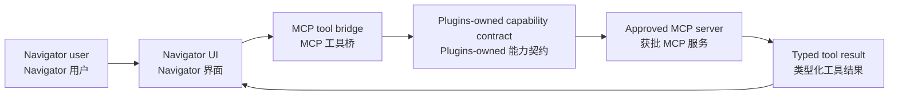

# MCP integration / MCP 集成

## Current posture / 当前状态

No MCP server, client, or bridge is connected in Navigator V1. The historical
MCP bridge surface is not part of this repository; there is no archived source
tree to extract from. Local tool and MCP integration is deferred until the
Plugins-owned capability contract (`mcp.server.v1` / `tool.provider.v1`) is
accepted and connected.

Navigator V1 未接入任何 MCP 服务端、客户端或桥接。历史 MCP 桥接范围不属于本仓库，
也没有可供提取的归档源码树。本地工具与 MCP 集成推迟到 Plugins-owned 能力契约
（`mcp.server.v1` / `tool.provider.v1`）被接受并接入之后。

## Intended bridge boundary / 预期桥接边界

The bridge should validate server identity, tool name, arguments, approval state,
and result shape at the direct endpoint. It should not expose unrestricted shell,
filesystem, credential, or hardware access merely because a server speaks MCP,
and it must not route business calls through a Platform payload API.

桥接层应在直连端点校验服务身份、工具名称、参数、审批状态与结果结构。服务使用 MCP
并不意味着桥接层可以暴露不受限制的 shell、文件系统、凭证或硬件访问，也不得将业务
调用经由 Platform payload API 转发。

## Review checklist / 评审清单

- Resolve MCP servers through the Plugins-owned capability contract at the direct endpoint.
- Keep user approval and cancellation observable in the client UI.
- Apply request, response-size, timeout, and origin policies at the hosting boundary.
- Preserve typed errors and avoid leaking server internals or secrets.
- Record enough capability identity for reproducible client diagnostics.

- 通过 Plugins-owned 能力契约在直连端点解析 MCP 服务。
- 确保用户审批与取消在客户端界面可见。
- 在宿主边界应用请求、响应大小、超时与来源策略。
- 保留类型化错误，避免泄漏服务内部细节或密钥。
- 记录足够的能力身份，便于复现客户端诊断。
