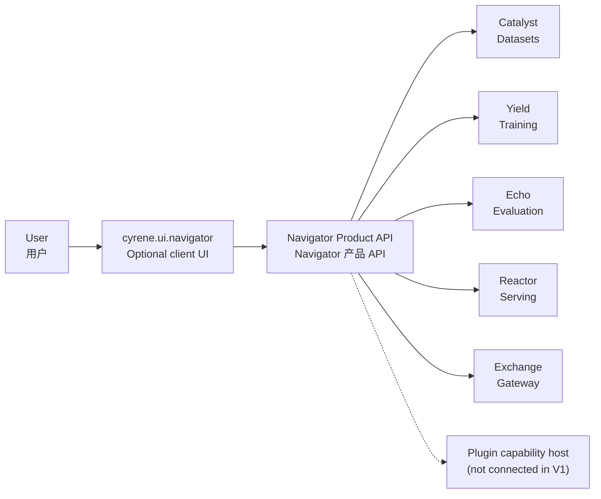

# Navigator architecture overview / Navigator 架构概览

## Role and boundary / 角色与边界

Navigator is a horizontal Product API and local host rather than a terminal stage in a product pipeline. Optional clients present user-facing workflows through this API, while Navigator owns durable session state and Product handoffs.

Navigator 是横向 Product API 与本地宿主，而不是产品流水线中的终端阶段。可选客户端通过该 API 呈现用户工作流，Navigator 拥有持久会话状态与 Product handoff。

The active repository surface is the pinned DeepSeek Harness adapters
(`harness/`), the Rust native host (`native/`), and the Python session
persistence and Product read service (`src/cyrene_navigator`). The optional
browser and WinUI clients live in `cyrene.ui.navigator` and consume the
published Navigator API without owning durable Product state.

当前仓库的活跃范围是固定版本 DeepSeek Harness 适配器（`harness/`）、Rust 原生宿主
（`native/`）与 Python 会话持久化及 Product 读取服务（`src/cyrene_navigator`）。可选的
浏览器与 WinUI 客户端位于 `cyrene.ui.navigator`，通过公开 Navigator API 读取数据，不拥有
持久 Product 状态。

## Workspace topology / 工作区拓扑

Product calls are implemented as direct HTTP fan-out through the Navigator
`ProductReadPort`; each Product remains the authority for its domain state.
Local Plugin capability hosting (skills, tools, MCP, memory, model providers)
is not connected in V1 and must wait for accepted Plugins-owned contracts.

产品调用已实现为经 Navigator `ProductReadPort` 的直连 HTTP fan-out；各产品仍是其领域
状态的权威。本地 Plugin 能力宿主（skills、tools、MCP、memory、model providers）在 V1
尚未接入，必须等待 Plugins-owned 契约被接受后再实现。

## Client flow / 客户端流程

1. The user selects an action in an optional client.
2. The client calls Navigator's published Product API.
3. Navigator calls the owning Product API directly or resolves durable session state.
4. The owning authority performs the domain operation.
5. The client renders progress, results, approvals, and errors without taking ownership of remote domain state.

1. 用户在可选客户端中选择操作。
2. 客户端调用 Navigator 公开 Product API。
3. Navigator 直连对应 Product API 或解析持久会话状态。
4. 对应权威执行领域操作。
5. 客户端呈现进度、结果、审批与错误，但不接管远程领域状态。

## Ownership boundaries / 归属边界

- Navigator owns Product APIs, local-host coordination, session persistence, and handoffs.
- `cyrene.ui.navigator` owns optional presentation and Product-client adapters.
- Catalyst owns dataset management and lineage.
- Yield owns training runs and model artifacts.
- Echo owns evaluation reports and comparisons.
- Reactor owns deployments and serving endpoints.
- Exchange owns standardized gateway and chat transport behavior.
- Platform provides optional installation, compatibility, and control-plane services; capability payload contracts and implementations belong to their Product or Plugin repositories.

- Navigator 负责 Product API、本地主机协调、会话持久化与 handoff。
- `cyrene.ui.navigator` 负责可选展示层与 Product 客户端适配器。
- Catalyst 负责数据集管理与血缘。
- Yield 负责训练运行与模型制品。
- Echo 负责评估报告与对比。
- Reactor 负责部署与服务端点。
- Exchange 负责标准化网关与聊天传输行为。
- Platform 提供可选的安装、兼容与控制平面服务；能力载荷契约与实现归属其 Product 或
  Plugin 仓库。
