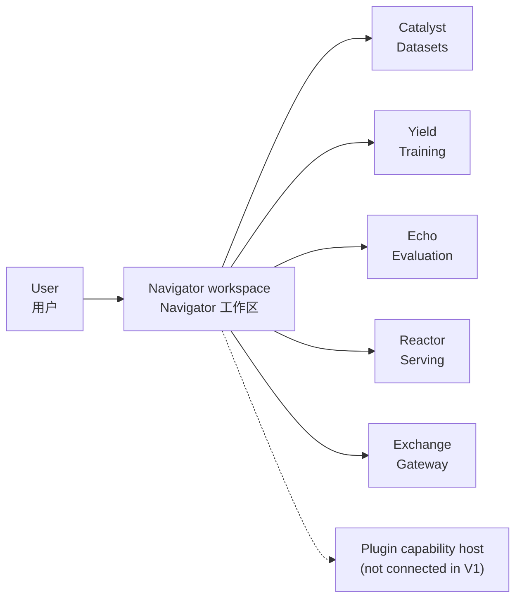

# Navigator architecture overview / Navigator 架构概览

## Role and boundary / 角色与边界

Navigator is a horizontal client workspace rather than a terminal stage in a product pipeline. It presents user-facing workflows, calls Cyrene Product APIs directly, and hosts client-side session state.

Navigator 是横向客户端工作区，而不是产品流水线中的终端阶段。它承载面向用户的工作流，直连 Cyrene 产品 API，并承载客户端会话状态。

The active repository surface is the client implementation: the browser WebUI
(`apps/desktop`), the WinUI client (`apps/windows`, `API_CONNECTED_PROTOTYPE`
whose reads come from the Navigator persistence API), the pinned DeepSeek Harness
adapters (`harness/`), the Rust native host (`native/`), and the Python session
persistence and Product read service (`src/cyrene_navigator`).

The browser surface is currently an API availability probe and documentation
preview. The native surface is an independent WinUI presentation mode: it reads
through `Core/Ports`, while send, cancel, and approve remain fail-closed until
the Harness control route is exposed. Neither surface is a packaged or signed
binary release.

当前仓库的活跃范围是客户端实现：浏览器 WebUI（`apps/desktop`）、WinUI 客户端
（`apps/windows`，`API_CONNECTED_PROTOTYPE`，读取路径来自 Navigator 持久化 API）、
固定版本 DeepSeek Harness 适配器（`harness/`）、Rust 原生宿主（`native/`）与 Python
会话持久化及产品读取服务（`src/cyrene_navigator`）。

当前浏览器界面仅做 API 可用性探测并预览文档。原生界面是独立的 WinUI 呈现模式：经
`Core/Ports` 读取；Harness 控制通道开放前，发送、取消和审批保持 fail-closed。两个界面
目前都不是已打包或已签名的二进制发布物。

## Workspace topology / 工作区拓扑

Product calls are implemented as direct HTTP fan-out through the Navigator
`ProductReadPort`; each Product remains the authority for its domain state.
Local Plugin capability hosting (skills, tools, MCP, memory, model providers)
is not connected in V1 and must wait for accepted Plugins-owned contracts.

产品调用已实现为经 Navigator `ProductReadPort` 的直连 HTTP fan-out；各产品仍是其领域
状态的权威。本地 Plugin 能力宿主（skills、tools、MCP、memory、model providers）在 V1
尚未接入，必须等待 Plugins-owned 契约被接受后再实现。

## Client flow / 客户端流程

1. The user selects a workspace action.
2. Navigator calls the owning Product API directly (or resolves client-side session state).
3. The owning authority performs the domain operation.
4. Navigator renders progress, results, approvals, and errors without taking ownership of remote domain state.

1. 用户选择工作区操作。
2. Navigator 直连对应产品 API（或解析客户端会话状态）。
3. 对应权威执行领域操作。
4. Navigator 呈现进度、结果、审批与错误，但不接管远程领域状态。

## Ownership boundaries / 归属边界

- Navigator owns workspace state, presentation, local-host coordination, session persistence, and client preferences.
- Catalyst owns dataset management and lineage.
- Yield owns training runs and model artifacts.
- Echo owns evaluation reports and comparisons.
- Reactor owns deployments and serving endpoints.
- Exchange owns standardized gateway and chat transport behavior.
- Platform provides optional installation, compatibility, and control-plane services; capability payload contracts and implementations belong to their Product or Plugin repositories.

- Navigator 负责工作区状态、呈现、本地主机协调、会话持久化与客户端偏好。
- Catalyst 负责数据集管理与血缘。
- Yield 负责训练运行与模型制品。
- Echo 负责评估报告与对比。
- Reactor 负责部署与服务端点。
- Exchange 负责标准化网关与聊天传输行为。
- Platform 提供可选的安装、兼容与控制平面服务；能力载荷契约与实现归属其 Product 或
  Plugin 仓库。
