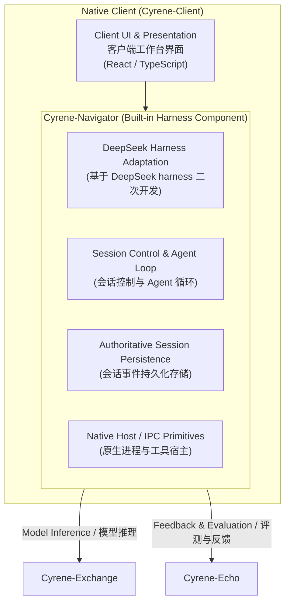

# Navigator architecture overview / Navigator 架构概览

## Role and boundary / 角色与边界

Navigator is a **built-in Harness component** of the Native Client (`Cyrene-Client`), developed as a secondary development of **DeepSeek harness** (`@deepseek-ai/deepseek-harness`).

It provides the test and execution Harness runtime, Agent loop coordination, and authoritative local session persistence.

**Key Clarifications & Invariants**:
- **Navigator carries NO UI**: Navigator contains no presentation layer or user interface. All graphical user interfaces, interactive controls, and visual consoles are exclusively owned and rendered by the Native Client (`Cyrene-Client`).
- **Navigator carries NO unrelated service features**: Navigator is strictly a client-internal Harness component. It does not provide server-side model training (owned by Yield), serving deployment (owned by Reactor), dataset preparation (owned by Catalyst), evaluation (owned by Echo), gateway governance (owned by Exchange), or kernel process supervision (owned by Platform).

Navigator 是 Native Client（`Cyrene-Client`）的**内置 Harness 组件**，基于 **DeepSeek harness**（`@deepseek-ai/deepseek-harness`）进行二次开发。

它为 Native Client 提供会话执行与测试适配 Harness 运行时、Agent 执行循环协调以及权威的本地会话持久化支持。

**核心澄清与架构不变量**：
- **Navigator 本身不带 UI**：Navigator 不包含任何展示层或图形界面。所有的工作台 UI、用户交互界面与可视化面板均完全由 Native Client（`Cyrene-Client`）拥有与渲染。
- **Navigator 不带其他无关功能**：Navigator 是一个纯粹的客户端内置 Harness 组件，不包含任何与 Harness 无关的服务功能。服务端模型训练（归 Yield 所有）、模型推理部署（归 Reactor 所有）、数据集清洗处理（归 Catalyst 所有）、评测与反馈分析（归 Echo 所有）、API 网关治理（归 Exchange 所有）及平台内核调度（归 Platform 所有）均由各对应专业仓库负责。

## System topology / 系统拓扑

```mermaid
flowchart TD
    subgraph Client["Native Client (Cyrene-Client)"]
        UI["Client UI & Presentation\n客户端工作台界面\n(React / TypeScript)"]
        subgraph Navigator["Cyrene-Navigator (Built-in Harness Component)"]
            DSH["DeepSeek Harness Adaptation\n(基于 DeepSeek harness 二次开发)"]
            SessionCtrl["Session Control & Agent Loop\n(会话控制与 Agent 循环)"]
            Persistence["Authoritative Session Persistence\n(会话事件持久化存储)"]
            NativeHost["Native Host / IPC Primitives\n(原生进程与工具宿主)"]
        end
        UI --> Navigator
    end

    Navigator -->|Model Inference / 模型推理| Exchange["Cyrene-Exchange"]
    Navigator -->|Feedback & Evaluation / 评测与反馈| Echo["Cyrene-Echo"]
```

## Component structure / 组件结构

1. **Harness Layer (`harness/`)**:
   - Secondary development integrating pinned upstream DeepSeek harness packages (`@deepseek-ai/dsh-*`).
   - Adapts upstream session lifecycle, event streams, and agent loop execution to the native client environment.
2. **Persistence Service (`src/cyrene_navigator/persistence/`)**:
   - Authoritative local storage for `SessionHeader` and append-only event logs in SQLite.
   - Provides deterministic session recovery without duplicating remote product state.
3. **Native Host (`native/`)**:
   - Rust workspace providing supervised child-process execution and local tool isolation hooks.

## Ownership boundaries / 归属边界

- **Navigator owns**: DeepSeek harness runtime adaptation, Agent loop coordination, authoritative local session event persistence, and native host supervisor primitives.
- **Navigator does NOT own**:
  - Presentation or UI (owned exclusively by `Cyrene-Client`).
  - Datasets or data preparation (owned by `Cyrene-Catalyst`).
  - Model training or checkpoint creation (owned by `Cyrene-Yield`).
  - Evaluation suites or benchmark metrics (owned by `Cyrene-Echo`).
  - Inference serving deployment (owned by `Cyrene-Reactor`).
  - API gateway routes or tenant billing (owned by `Cyrene-Exchange`).
  - Platform process supervision or lease fences (owned by `Cyrene-Platform`).

- **Navigator 负责**：DeepSeek harness 运行时适配、Agent 循环协调、权威本地会话事件持久化，以及原生宿主监管原语。
- **Navigator 不负责**：
  - 展示层与 UI（完全归属于 `Cyrene-Client`）。
  - 数据集与数据清洗（归属 `Cyrene-Catalyst`）。
  - 模型训练与 Checkpoint 生成（归属 `Cyrene-Yield`）。
  - 评测套件与基准指标（归属 `Cyrene-Echo`）。
  - 推理服务端点与部署（归属 `Cyrene-Reactor`）。
  - 网关路由与租户计费（归属 `Cyrene-Exchange`）。
  - 平台进程监管与租约隔离（归属 `Cyrene-Platform`）。
