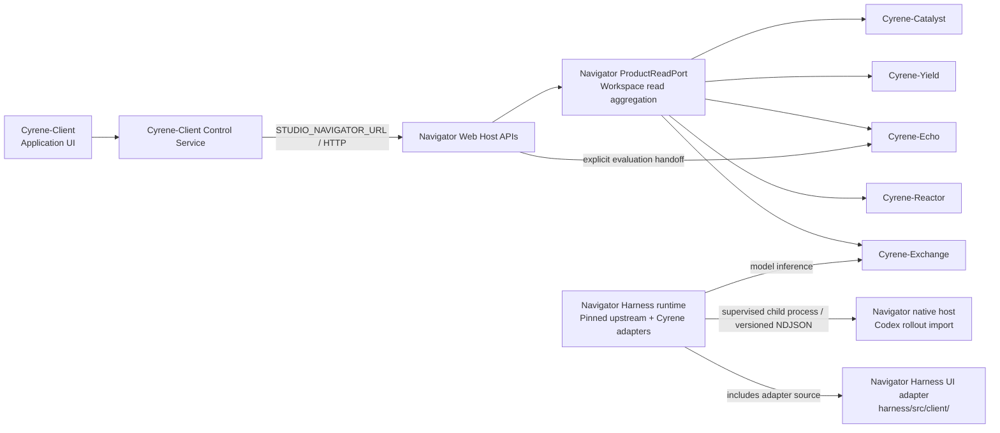

# Navigator architecture overview / Navigator 架构概览

## Role and boundary / 角色与边界

Navigator composes a pinned revision of the upstream DeepSeek Harness repository with Cyrene adapters and provides local session and Product-read APIs plus a Rust native host for Codex rollout import over versioned NDJSON. The upstream project owns the Agent Loop and Session event model; Navigator owns its Cyrene integration and persistence service.

`Cyrene-Client` owns the application shell and primary user-facing presentation. Its control service reaches the separate Navigator Web Host through `STUDIO_NAVIGATOR_URL`. Navigator also contains Harness UI adapters under `harness/src/client/`, but does not provide a standalone client application.

Navigator does not own Product services such as dataset processing, training, serving deployment, evaluation, or gateway governance. Each Product remains authoritative for its domain state.

Navigator 将固定版本的上游 DeepSeek Harness 仓库与 Cyrene 适配器组合，提供本地会话与 Product 读取 API，以及通过版本化 NDJSON 导入 Codex rollout 的 Rust 原生宿主。上游项目拥有 Agent Loop 与 Session 事件模型；Navigator 负责 Cyrene 集成和持久化服务。

`Cyrene-Client` 拥有应用 shell 和主要面向用户的展示层；其 control service 通过 `STUDIO_NAVIGATOR_URL` 访问独立的 Navigator Web Host。Navigator 也在 `harness/src/client/` 中包含 Harness UI 适配器，但不提供独立的客户端应用。

Navigator 不拥有数据集处理、训练、服务部署、评估或网关治理等 Product 服务；各 Product 仍是自身领域状态的权威。

## System topology / 系统拓扑

```mermaid
flowchart LR
    Client["Cyrene-Client\nApplication UI"] --> Control["Cyrene-Client Control Service"]
    Control -->|STUDIO_NAVIGATOR_URL / HTTP| WebHost["Navigator Web Host APIs"]
    HarnessRuntime["Navigator Harness runtime\nPinned upstream + Cyrene adapters"]
    HarnessUI["Navigator Harness UI adapter\nharness/src/client/"]
    HarnessRuntime -->|supervised child process / versioned NDJSON| NativeHost["Navigator native host\nCodex rollout import"]
    ProductRead["Navigator ProductReadPort\nWorkspace read aggregation"]
    WebHost --> ProductRead
    ProductRead --> Catalyst["Cyrene-Catalyst"]
    ProductRead --> Yield["Cyrene-Yield"]
    ProductRead --> Echo["Cyrene-Echo"]
    ProductRead --> Reactor["Cyrene-Reactor"]
    ProductRead --> Exchange["Cyrene-Exchange"]
    HarnessRuntime -->|model inference| Exchange
    HarnessRuntime -->|includes adapter source| HarnessUI
    WebHost -->|explicit evaluation handoff| Echo
```

## Component structure / 组件结构

1. **Harness Layer (`harness/`)**:
   - Composes the pinned upstream DeepSeek Harness source revision with the required `@deepseek-ai/dsh-*` packages.
   - Supplies Cyrene persistence and client adapters without replacing upstream Agent Loop or Session event authority.
2. **Persistence Service (`src/cyrene_navigator/persistence/`)**:
   - Authoritative local storage for `SessionHeader` and append-only event logs in SQLite.
   - Provides deterministic session recovery without duplicating remote product state.
3. **Native Host (`native/`)**:
   - Rust workspace providing the versioned NDJSON native host and Codex rollout import support.
4. **Product read service (`src/cyrene_navigator/reader.py`, `service.py`)**:
   - Exposes bounded Workspace read snapshots across the five Product APIs while keeping each Product authoritative for its own state.

## Ownership boundaries / 归属边界

- **Navigator owns**: DeepSeek Harness composition and Cyrene adapters, local session persistence, Product workspace-read aggregation, explicit Echo handoffs, Harness UI adapter code, and native host integration.
- **Navigator does NOT own**:
  - The Native Client application shell and primary user-facing presentation (owned by `Cyrene-Client`).
  - Datasets or data preparation (owned by `Cyrene-Catalyst`).
  - Model training or checkpoint creation (owned by `Cyrene-Yield`).
  - Evaluation suites or benchmark metrics (owned by `Cyrene-Echo`).
  - Inference serving deployment (owned by `Cyrene-Reactor`).
  - API gateway routes or tenant billing (owned by `Cyrene-Exchange`).
  - Platform process supervision or lease fences (owned by `Cyrene-Platform`).

- **Navigator 负责**：DeepSeek Harness 组合与 Cyrene 适配器、本地会话持久化、Product Workspace 读取聚合、显式 Echo 交接、Harness UI 适配代码及原生宿主集成。
- **Navigator 不负责**：
  - Native Client 应用 shell 和主要面向用户的展示层（归 `Cyrene-Client` 所有）。
  - 数据集与数据清洗（归属 `Cyrene-Catalyst`）。
  - 模型训练与 Checkpoint 生成（归属 `Cyrene-Yield`）。
  - 评测套件与基准指标（归属 `Cyrene-Echo`）。
  - 推理服务端点与部署（归属 `Cyrene-Reactor`）。
  - 网关路由与租户计费（归属 `Cyrene-Exchange`）。
  - 平台进程监管与租约隔离（归属 `Cyrene-Platform`）。
