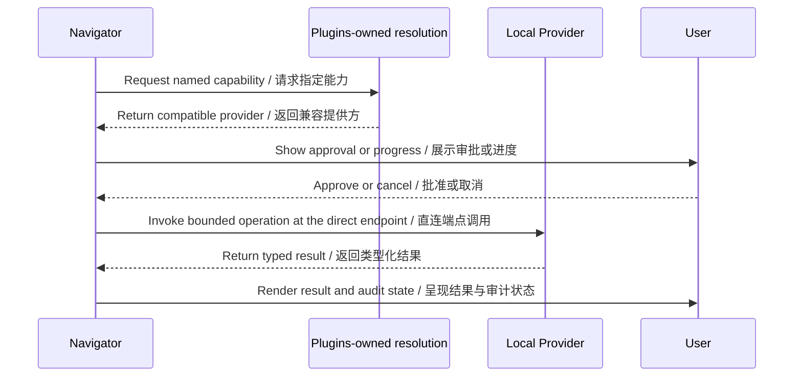

# Tool and capability system / 工具与能力系统

## Current posture / 当前状态

Navigator V1 does not contain a local capability resolver or local provider
implementations. Product calls are implemented as direct HTTP fan-out through
`ProductReadPort`; capability IDs, payload schemas, SDKs, and TCKs are owned by
their Product or Plugin repositories and are not declared here.

Navigator V1 不包含本地能力解析器或本地提供方实现。产品调用已实现为经
`ProductReadPort` 的直连 HTTP fan-out；能力 ID、载荷 schema、SDK 与 TCK 由其所属
Product 或 Plugin 仓库拥有，不在本仓库声明。

## Capability seams / 能力接缝

Status values reflect the Plugins canonical index at the audited SHA. None of
these seams is connected by Navigator V1; a seam may only be consumed after its
owner contract is accepted.

下表状态来自审计 SHA 的 Plugins 规范索引。Navigator V1 均未接入这些接缝；只有在
owner contract 被接受后才能消费。

| Capability seam | Navigator-facing role / Navigator 侧职责 | Status |
|---|---|---|
| `skill.runtime.v1` | Reusable skill workflows for local agent use / 本地智能体使用的可复用技能工作流 | `MIGRATING` (no owner schema/SDK/TCK/entrypoint) |
| `tool.provider.v1` | Approved local tools, including MCP-backed tools / 获批本地工具，包括基于 MCP 的工具 | `MIGRATING` (compatibility snapshot) |
| `mcp.server.v1` | MCP server tools / MCP 服务端工具 | `MIGRATING` (compatibility snapshot) |
| `memory.provider.v1` | User-approved workspace memory / 用户批准的工作区记忆 | Owner contract exists; not connected |
| `model.provider.v1` | Model calls used by local workflows / 本地工作流使用的模型调用 | Owner contract exists; not connected |
| `model.registry.v1` | Model metadata and version identity / 模型元数据与版本身份 | `NOT_DEFINED` |

Capability providers own their operation; Navigator owns user intent,
presentation, and client-side coordination.

能力提供方负责自身操作；Navigator 负责用户意图、呈现与客户端协调。

## Intended resolution sequence / 预期解析时序（V1 未接入）

## Non-ownership rules / 非归属规则

- Navigator must not bypass the Plugins-owned capability contract when local tool
  integration is connected.
- A local provider must not silently become the authority for workspace or product state.
- Approval, cancellation, and progress must remain visible at the client boundary.
- Remote Product connectors preserve each Product's API and error boundaries and
  never assume a Platform capability payload API.
- Capability integration must wait for an accepted owner contract; no capability
  ID or payload may be invented in this repository.

- 接入本地工具时，Navigator 不得绕过 Plugins-owned 能力契约。
- 本地提供方不能静默成为工作区或产品状态的权威。
- 审批、取消与进度必须在客户端边界可见。
- 远程产品连接器保留各产品的 API 与错误边界，且不得假设 Platform capability payload API。
- 能力接入必须等待 owner contract 被接受；不得在本仓库发明 capability ID 或载荷。
